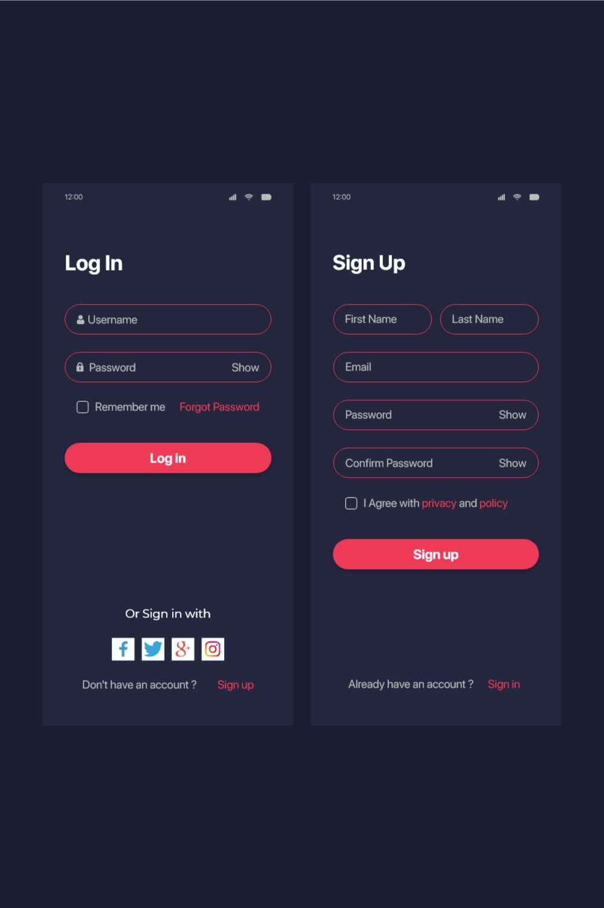
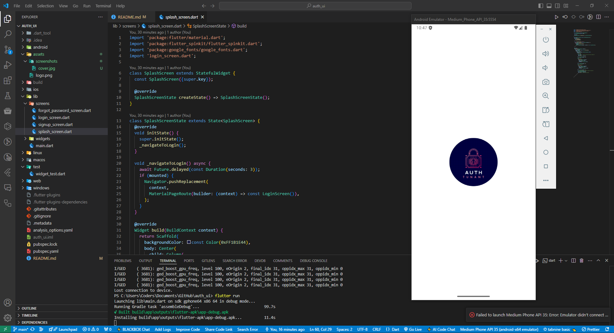
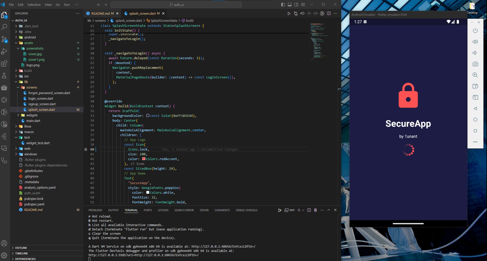
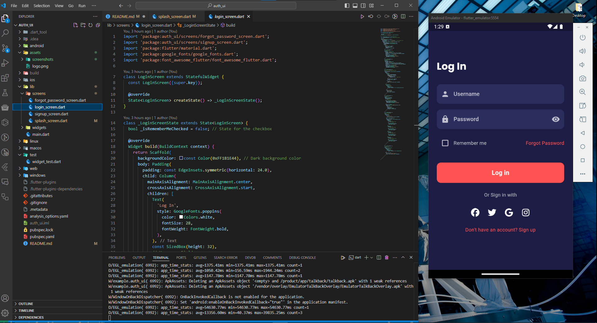
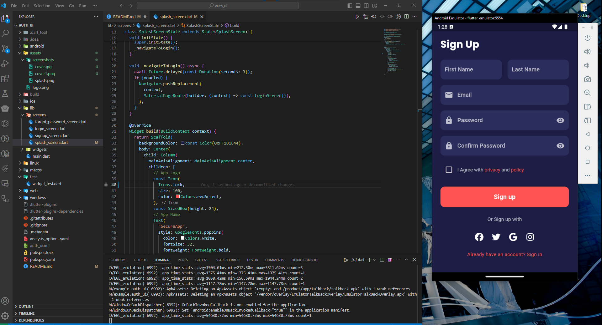
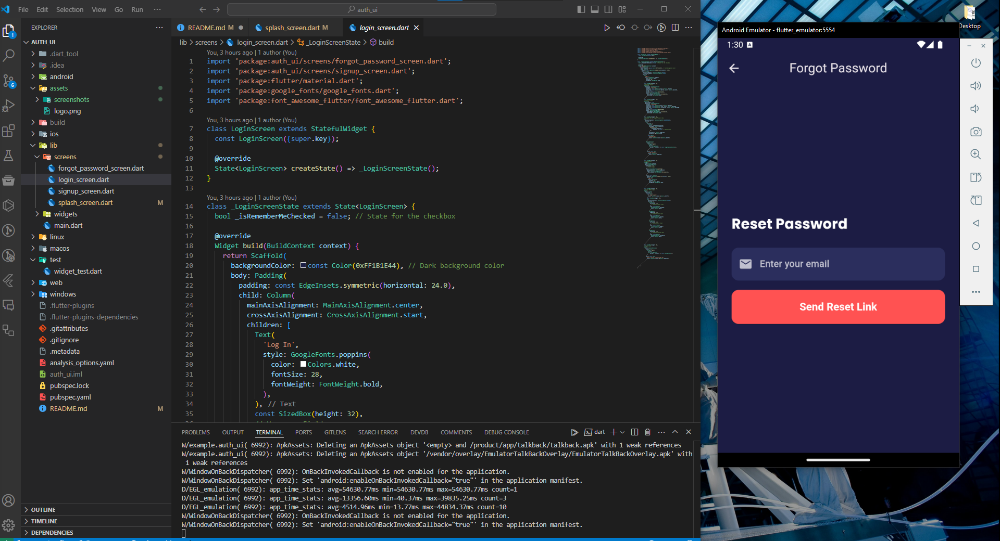

# auth_ui

Flutter Auth



## Overview

A flutter design for login, sign up and forget password. Made by Tunant

## Features

- Splash Screen with animation
- Login Screen
- Sign Up Screen
- Forgot password screen

### Screenshots



### Splash Screen



### Login Screen



### Sign Up Screen



### Forget Password Screen



## Actual Screenshots on Mobile

<div style="display: flex; justify-content: space-around;">
  
  
  
  
</div>

## Getting Started

### Prerequisites

- Flutter SDK
- Dart version

### Installation

```bash
git clone https://github.com/yourusername/project-name.git
cd auth_ui
flutter pub get
flutter run
```
